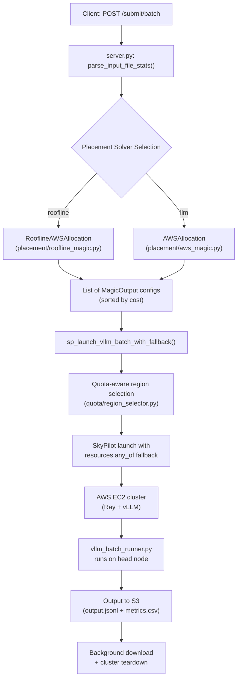

# Orca System Architecture

## Overview

Orca is a batch inference orchestration system that automates the end-to-end lifecycle of large language model (LLM) inference jobs on AWS. Given a model name, an input file, and an SLO deadline, Orca determines the optimal GPU configuration, provisions cloud infrastructure via [SkyPilot](https://github.com/skypilot-org/skypilot), runs the inference workload with [vLLM](https://github.com/vllm-project/vllm), and delivers results to S3.

The system is built around two core ideas: **deterministic placement** using a roofline throughput model to select the cheapest GPU/TP/PP configuration that meets the SLO, and **multi-level fallback** that tries progressively more expensive configurations across quota-aware region orderings until a cluster launches successfully.

This document describes the architecture of the `magic_py` branch.

## Design Goals

- **Cost-optimal placement.** Select the cheapest GPU configuration that can meet the user's throughput SLO, using a roofline model rather than heuristics or LLM-based reasoning.
- **Automatic fallback.** When the cheapest configuration cannot be provisioned (insufficient quota, spot unavailability), fall back to the next-best configuration automatically.
- **Quota awareness.** Pre-filter regions and instance types by actual AWS vCPU quota before attempting to launch, avoiding wasted provisioning attempts.
- **Correct distributed cleanup.** Avoid the NCCL/TCPStore shutdown errors that plague vLLM's default batch runner by using a custom runner with explicit distributed teardown.
- **Minimal operator intervention.** A single API call handles input parsing, placement solving, cluster provisioning, inference execution, result upload, and cluster teardown.

## High-Level Flow

The system processes a batch inference request through five stages:



**1. Input parsing.** The server downloads the input JSONL from S3, counts requests, and estimates average/max token lengths (characters / 4).

**2. Placement solving.** The selected solver (roofline or LLM-based) evaluates available GPU instance types against the workload and returns one or more placement configurations, each specifying an instance type, tensor parallelism (TP) degree, pipeline parallelism (PP) stages, replica count, and the maximum context length the configuration can support.

**3. Cluster provisioning.** For each configuration (cheapest first), the system builds a SkyPilot task with a `resources.any_of` list of region/spot candidates sorted by quota. SkyPilot attempts each candidate in order. If a configuration fails across all regions, the next configuration is tried.

**4. Inference execution.** On the provisioned cluster, the custom batch runner loads the model with vLLM, applies chat templates, filters requests that exceed `max_model_len`, generates completions, and writes output in OpenAI batch format alongside a `metrics.csv` with throughput and latency statistics.

**5. Result collection.** A background thread monitors cluster logs, downloads output from S3 when the job completes, and terminates the cluster.

## Placement Solvers

### Roofline Solver (default)

The roofline solver (`placement/roofline_magic.py`) provides deterministic, cost-optimal GPU selection. It is the default solver and the recommended choice for production workloads.

The solver operates in three phases:

**Phase 1: GPU pool construction.** The solver loads AWS quota data from `quota/aws_gpu_quota_by_region.csv`, filters to multi-GPU instance families capable of serving LLMs (p4d, p4de, p5, g6e.12xlarge+, g5.12xlarge+, p3.16xlarge+), and further filters to instances present in `cloud_instances_specs.csv`.

**Phase 2: Roofline enumeration.** The `PlacementSolverAdapter` (`placement/roofline/solver_adapter.py`) normalizes the model name, loads the model's architecture config from the `LLM_placement_solver` submodule, and invokes `LLMPlacementSolverWithTP.solve_homogeneous()`. This enumerates all feasible (instance, TP, PP, batch_size) combinations, checking:

- **Memory feasibility:** Model weights, KV cache, and activation memory must fit in GPU VRAM after partitioning across TP/PP.
- **Throughput estimation:** The roofline model computes `throughput = min(compute_bound, memory_bound, network_bound)` where each bound is derived from the GPU's FLOPS, memory bandwidth, and inter-node network bandwidth respectively.
- **Cost calculation:** `cost_per_M_tokens = (num_instances * instance_price_per_hour) / throughput * 1M`.

Results are sorted by the configured priority (`cost_first`, `throughput_first`, or `balanced`).

**Phase 3: Context length calculation.** For the selected configuration, `calculate_max_supported_context()` (`placement/roofline/gpu_specs.py`) computes the maximum sequence length that fits in the remaining GPU memory after model weights, capped by the model's `max_position_embeddings`. This value is passed to vLLM as `--max-model-len`.

When the solver is given a custom GPU pool (derived from Orca's quota data), it writes temporary `gpu_pool.csv` and `network_bandwidth.csv` files, passes them to the solver constructor, and cleans them up after solving.

### LLM-Based Solver (experimental)

The LLM-based solver (`placement/aws_magic.py`) uses a 3-advisor architecture with C-PMI scoring. Three LLM "advisors" independently propose GPU configurations, and a scoring function selects the best. This solver can reason about edge cases but is slower, non-deterministic, and returns a single solution. It requires an OpenRouter API key (`TD_OPENROUTER_KEY`).

## Fallback Launch Strategy

The system implements a two-level fallback:

**Level 1: Region fallback** (handled by SkyPilot). For a given configuration, the quota-aware region selector (`quota/region_selector.py`) queries AWS quotas across eight regions, filters by sufficient vCPU availability, and sorts candidates by quota descending with spot instances before on-demand. These candidates are passed as a SkyPilot `resources.any_of` list, and SkyPilot tries each in order.

**Level 2: Configuration fallback** (handled by Orca). `sp_launch_vllm_batch_with_fallback()` iterates over solver configurations sequentially. If `sky.launch()` raises an exception for one configuration (all regions exhausted), the next configuration is attempted. This continues until a launch succeeds or all configurations are exhausted.

```
Solver output: [Config1 (cheapest), Config2, Config3, ...]

For each config:
  1. get_ordered_regions() -> [us-east-1/spot, us-west-2/spot, us-east-1/on-demand, ...]
  2. Build SkyPilot task with resources.any_of = [region candidates]
  3. sky.launch(task)
     - SkyPilot tries each region/spot candidate in order
     - If all fail -> exception
  4. Success? -> return (True, config)
     Exception? -> try next config

All configs failed -> return (False, primary_config)
```

## Batch Runner

The batch runner (`templates/vllm_batch_runner.py`) is mounted onto each provisioned cluster and executed on the head node. It replaces vLLM's built-in `run-batch` command to address several issues with distributed cleanup.

Key behaviors:

- **Engine selection.** Uses `AsyncLLMEngine` when pipeline parallelism is enabled (PP > 1) and synchronous `LLM` otherwise. The Ray distributed backend is used whenever TP > 1 or PP > 1; the `mp` (fork) backend is used for single-GPU.
- **Prompt validation.** Tokenizes each prompt and skips requests where `input_len + max_tokens > max_model_len`, recording them as errors in the output.
- **Output format.** Writes OpenAI-compatible batch output (`output.jsonl`) with per-request token usage, plus a `metrics.csv` containing throughput, latency percentiles, model/infra configuration, and timing breakdowns.
- **Distributed cleanup.** After generation completes, the runner explicitly deletes the LLM object, calls `cleanup_dist_env_and_memory()`, empties the CUDA cache, and synchronizes all devices. This avoids the NCCL/TCPStore errors that occur when the process exits with active distributed state.

## Template System

SkyPilot task definitions are generated from templates at launch time.

**Generic template** (`templates/vllm.yaml`): Defines the `setup:` phase (GPU detection, vLLM installation, compatibility patches) and environment variables. The `run:` section is injected from `templates/vllm_run`, which handles Ray cluster setup and batch runner invocation with all necessary arguments.

**Per-config templates** (`templates/vllm_configs/`): For tested GPU+model combinations (e.g., `vllm_qwen2.5-72b-A100-tp8-pp1.yaml`), pre-baked templates override the generic one. `get_vllm_config_template()` in `server.py` checks for a matching per-config template first, falling back to generic.

**GPU-specific version selection**: The setup phase detects the GPU model and installs the appropriate vLLM version. A100 instances use vLLM 0.7.3 with PyTorch cu121 (to avoid CUDA 802 errors with driver 535.x); other GPUs use vLLM 0.10.0.

## Job Tracking

Orca tracks jobs and quota usage in memory (database-backed tracking is planned):

- **`VPCQuotaTracker`** (`tracking/tracking.py`): Thread-safe in-memory tracker for vCPU quota reservations per (region, market, instance family). Prevents over-subscription of AWS quotas across concurrent jobs.
- **`JobTracker`** (`server.py`): Maintains `JobRecord` state machines (`queued -> launching -> running -> succeeded/failed`) with progress fraction and infrastructure metadata.
- **`ClusterManager`** (`server.py`): Registry of active SkyPilot clusters. Ensures clusters are terminated after job completion and prevents zombie instances.

## Storage

The `storage/` module provides an abstract storage backend with an S3 implementation (`storage/backends/s3_big.py`). The server exposes presigned upload/download URLs so clients can upload input files and retrieve results without direct S3 credentials.

## Directory Structure

```
Tandemn-orca/
|-- server.py                       # FastAPI server, all endpoints, launch orchestration
|-- orca.py                         # Standalone LLM-based placement (experimental, not imported by server)
|
|-- placement/
|   |-- magic.py                    # VPCMagic base class
|   |-- aws_magic.py                # LLM-based 3-advisor solver
|   |-- roofline_magic.py           # Roofline-based solver
|   +-- roofline/
|       |-- __init__.py
|       |-- solver_adapter.py       # Adapter to LLM_placement_solver submodule
|       |-- gpu_specs.py            # GPU specs, calculate_max_supported_context()
|       |-- model_arch.py           # Model architecture definitions
|       |-- solver.py               # Local roofline model (ported, not used by adapter)
|       +-- throughput.py           # Throughput estimation
|
|-- quota/
|   |-- region_selector.py          # Quota-aware region selection
|   +-- aws_gpu_quota_by_region.csv
|
|-- templates/
|   |-- vllm.yaml                   # Generic SkyPilot task template
|   |-- vllm_run                    # Run script template (batch)
|   |-- vllm_run_online             # Run script template (online serving)
|   |-- vllm_online.yaml            # SkyPilot task template (online serving)
|   |-- vllm_batch_runner.py        # Custom batch inference script
|   |-- vllm_compat_patch.py        # Transformers 5.x compatibility patch
|   +-- vllm_configs/               # Per-config templates (GPU+model-specific)
|
|-- models/
|   |-- requests.py                 # BatchedRequest, OnlineServingRequest, vLLMSpecificConfig
|   +-- resources.py                # MagicOutput
|
|-- tracking/
|   +-- tracking.py                 # VPCQuotaTracker, JobSpec, JobState, JobRecord
|
|-- utils/
|   +-- utils.py                    # YAML helpers, URI parsing, quota CSV loading, perf DB
|
|-- storage/
|   |-- storage_server.py           # Storage backend singleton
|   |-- storage_factory.py          # Backend factory
|   +-- backends/
|       |-- base.py                 # Abstract storage backend
|       +-- s3_big.py               # S3 implementation
|
|-- perf_db/                        # Empirical throughput measurements
|
|-- LLM_placement_solver/           # Git submodule
|   |-- solver.py                   # LLMPlacementSolverWithTP
|   |-- llm_advisor/                # LLM-based advisor module
|   +-- config/
|       |-- cloud_instances_specs.csv
|       |-- gpu_pool.csv
|       |-- network_bandwidth.csv
|       |-- generate_network_bandwidth.py
|       |-- qwen2.5-72b/            # Per-model config directories
|       |-- qwen2.5-32b/
|       |-- qwen2.5-7b/
|       |-- qwen2.5-a14b/
|       |-- qwen3-235b-a22b/
|       |-- llama3-70b/
|       |-- llama3-8b/
|       +-- deepseek-v2/
|
+-- outputs/                        # Downloaded results
    +-- {model}/{workload}/{solver}-tp{T}-pp{P}-timestamp_{ts}/
```

## API Reference

### POST /submit/batch

Submit a batch inference job. The server parses the input file to determine `num_lines`, `avg_input_tokens`, and `max_input_tokens` automatically.

```json
{
  "user_id": "gangmuk",
  "input_file": "s3://bucket/input.jsonl",
  "output_file": "output.jsonl",
  "avg_output_tokens": 256,
  "model_name": "Qwen/Qwen2.5-72B-Instruct",
  "engine": "vllm",
  "slo_deadline_hours": 2,
  "placement_solver": "roofline",
  "vllm_specific_config": {
    "max_num_seqs": 32,
    "kv_cache_dtype": "auto"
  }
}
```

### POST /submit/online

Deploy a persistent online inference endpoint. Returns the public endpoint URL once the cluster is ready.

```json
{
  "user_id": "gangmuk",
  "model_name": "Qwen/Qwen2.5-72B-Instruct",
  "engine": "vllm",
  "placement": "auto"
}
```

### GET /quota/status

Returns the current in-memory quota reservation state across all regions and instance families.

### POST /storage/presigned_upload

Returns a presigned S3 URL for uploading input files.

### GET /storage/presigned_download

Returns a presigned S3 URL for downloading output files.

## Configuration

### Environment Variables

| Variable | Default | Description |
|----------|---------|-------------|
| `TD_PLACEMENT_SOLVER` | `roofline` | Placement solver: `roofline` or `llm` |
| `TD_PLACEMENT_PRIORITY` | `cost_first` | Optimization priority: `cost_first`, `throughput_first`, `balanced` |
| `HF_TOKEN` | -- | HuggingFace token for gated models |
| `TD_OPENROUTER_KEY` | -- | OpenRouter API key (required for LLM-based solver) |

### Cluster Environment Variables (set in templates)

| Variable | Value | Purpose |
|----------|-------|---------|
| `VLLM_USE_V1` | `1` | Enable vLLM V1 engine (default in v0.10.0) |
| `CUDA_DEVICE_ORDER` | `PCI_BUS_ID` | Consistent GPU ordering across nodes |
| `NCCL_ASYNC_ERROR_HANDLING` | `1` | Graceful error handling for multi-GPU NCCL |

## Compatibility Patches

The system applies several patches to work around known issues in the vLLM/transformers/SkyPilot stack:

| Issue | Root Cause | Fix |
|-------|-----------|-----|
| `all_special_tokens_extended` missing | Removed in transformers 4.47+ | `vllm_compat_patch.py` injects it via `sitecustomize.py` |
| `DisabledTqdm` duplicate kwargs | vLLM 0.10.x bug | `sed` patch in setup script |
| CUDA error 802 on A100 | vLLM 0.10.0 incompatible with driver 535.x | GPU detection installs vLLM 0.7.3 + torch cu121 for A100 |
| Ray cluster setup failure | SkyPilot's `start_cluster` script broken | Manual `ray start` in run script |
| NVSwitch Fabric Manager down | Not auto-started on some AMIs | Auto-detect and start for p4d/p5 instances |

## Design Decisions

1. **Roofline over LLM-based placement.** Deterministic placement is more predictable and debuggable. The roofline model can evaluate thousands of configurations in milliseconds, whereas the LLM-based solver requires multiple API calls and produces non-reproducible results.

2. **Multi-level fallback.** GPU spot availability is unpredictable. By trying progressively more expensive configurations, each across multiple regions, the system maximizes the probability of a successful launch without operator intervention.

3. **SkyPilot `any_of` for region fallback.** Region iteration within a single configuration is delegated to SkyPilot's native `resources.any_of` mechanism rather than manual retry loops, reducing code complexity and leveraging SkyPilot's built-in error handling.

4. **Quota pre-filtering.** Attempting to launch in a region with insufficient quota wastes provisioning time. Pre-filtering by live quota data (with 5-minute caching) eliminates these wasted attempts.

5. **Custom batch runner over `vllm run-batch`.** The default vLLM batch runner does not properly tear down distributed state, causing NCCL/TCPStore errors on exit that can leave GPU memory allocated. The custom runner handles this explicitly.

6. **Single-instance preference for tensor parallelism.** TP requires high-bandwidth intra-node communication (NVLink). The solver prefers one 8-GPU instance over two 4-GPU instances, reserving multi-node configurations for pipeline parallelism only.

7. **GPU-specific vLLM versions.** A100 instances with NVIDIA driver 535.x encounter CUDA 802 errors with vLLM 0.10.0. Rather than requiring AMI updates, the template detects the GPU and installs the appropriate version.

8. **Per-config templates.** For validated GPU+model combinations, pre-baked SkyPilot templates eliminate runtime template substitution errors and allow per-combination tuning of vLLM flags.

9. **Solver as git submodule.** The core roofline solver (`LLM_placement_solver`) is maintained as a separate repository, allowing independent development and versioning of the solver without coupling it to Orca's release cycle.
